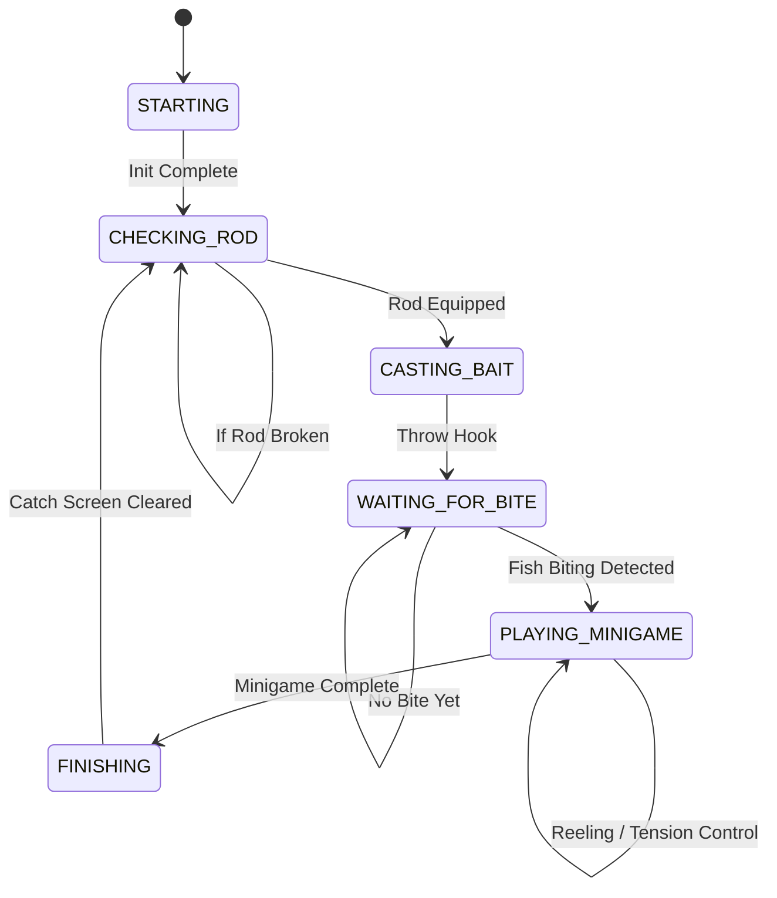

### Note: This is a private version of the bot, ported from Python to Java and compatible with Windows and Linux.

# BPSR Fishing Bot

A fully automated, state-machine driven fishing bot developed in Java. The application utilizes computer vision through JavaCV (OpenCV) for screen detection and automated game interaction.

## Overview

The BPSR Fishing Bot is designed to automate the fishing mini-game process. It captures the screen region of interest, analyzes the visual state using template matching, and executes the appropriate inputs based on a robust state machine logic. It features a graphical user interface (GUI) built with Swing and FlatLaf, providing tools for real-time debugging, logging, and region of interest (ROI) configuration.

## Features

- **Automated Fishing Pipeline:** Handles the complete fishing cycle including casting, waiting for a bite, playing the mini-game, and finishing the catch.
- **Computer Vision Integration:** Uses OpenCV template matching for high-performance visual recognition of in-game indicators.
- **State Machine Architecture:** Ensures reliable state transitions and error recovery during the fishing process.
- **Graphical User Interface (GUI):**
  - **Dashboard:** Start and stop controls with real-time state monitoring.
  - **ROI Editor:** Visually configure capture zones.
  - **Debugger:** Real-time feedback on detection precision and template matching scores.
  - **Config Panel:** Fine-tune timeouts, precision, and application settings.
- **Cross-Platform Support:** Configured to build standalone executables for both Windows and Linux.

## Additional Information

- You can use external templates if they changed or have difficult to be detected; simply create a "templates" folder in the same directory as the bot file.
- A templates folder is available in the releases, but the filenames must match exactly; otherwise, the default templates will be used.
- Templates should have transparent background

**Note**: Config.json is an auto generated file

**E.g**: how use templates
```plain
folder/
├── BPSR-Fishing-Bot-Java-V2-windows-x86_64-all.jar
├── Config.json 
└── templates
    └── files.png
```

## Architecture

The bot is structured into several core modules:
- `fishbot.core.FishingBot`: The main execution loop controlling screen capture and state handling.
- `fishbot.core.state`: Implementation of the finite state machine (`Starting`, `CheckingRod`, `CastingBait`, `WaitingForBite`, `PlayingMinigame`, `Finishing`).
- `fishbot.core.game.Detector`: Manages screen capturing and OpenCV template matching.
- `fishbot.ui`: The frontend GUI including the dashboard, ROI editor, and log viewer.
- `fishbot.config`: Persistent configuration management for ROIs, template definitions, and user preferences.

## State Flow



## Prerequisites

- **Java Development Kit (JDK):** Version 25 or higher (requires `--enable-native-access=ALL-UNNAMED`).
- **Gradle:** For dependency management and building.
- **Operating System:** Windows (x86_64) or Linux (x86_64).

## Build Instructions

The project uses Gradle with the Shadow plugin to create fat JARs containing all required native libraries.

To build the executable JAR for Windows:
```bash
./gradlew buildWindows
```

To build the executable JAR for Linux:
```bash
./gradlew buildLinux
```

To build for both platforms simultaneously:
```bash
./gradlew buildAll
```

The compiled JAR files will be located in the `build/libs` directory.

## Usage

Run the compiled JAR file. Native access must be enabled for the JNA platform integrations.

```bash
java --enable-native-access=ALL-UNNAMED -jar build/libs/Java-V2-windows-x86_64-all.jar
```

*Note: The exact JAR name will depend on your target OS and version configured in `build.gradle.kts`.*

### Dashboard Tools

1. **Start/Stop:** Controls the main bot loop. Note that the bot will initiate a countdown before active capturing begins.
2. **ROIs (Region of Interest):** Opens the editor to set up the screen boundaries that the bot will analyze.
3. **Debugger:** Opens a window to monitor OpenCV matching scores in real-time.
4. **Logs:** Displays operational logs, state changes, and error messages.
5. **Config:** Provides access to adjust configuration parameters like detection precision and FPS limits.

## Configuration

The bot relies on a configuration file which dictates behavior and detection criteria. Key settings include:
- `DETECTION_PRECISION`: The threshold for template matching confidence.
- `TARGET_FPS`: The frame rate at which the screen is captured and processed.
- `START_COUNTDOWN`: Delay in seconds before the bot begins operation after pressing Start.
- `QUICK_SKIP_MODE`: Fast-forwards certain animations if applicable.

Ensure your templates and ROIs are correctly set up through the UI before running the bot in an active game environment.

Not Accepting Pull requests